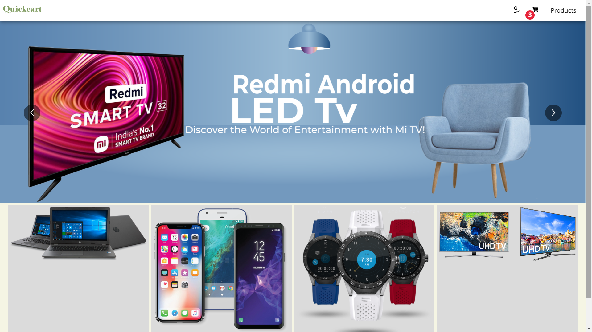

# Electronics E-commerce 


## Demo
This is a simple e-commerce web application built using the MERN (MongoDB, Express.js, React, Node.js) stack. It allows users to browse and purchase products online.

;

- [MongoDB](https://www.mongodb.com/)
- [Express.js](https://expressjs.com/)
- [React](https://reactjs.org/)
- [Node.js](https://nodejs.org/)
- [Other libraries or tools]


```bash
# Clone the repository
git clone https://github.com/paul-sourav/your-repo.git

# Change directory
cd your-repo

# Install dependencies
npm install
